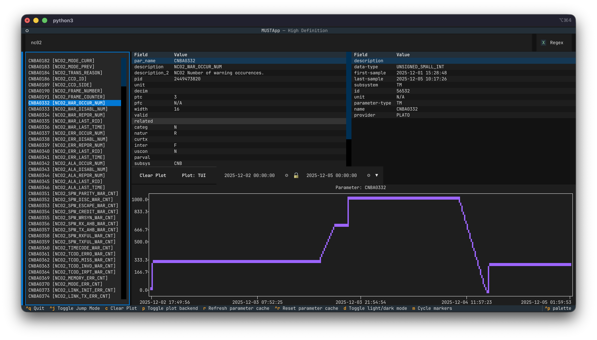

# Using the TUI

The MUST TUI launches in a terminal and provides interactive access to telemetry parameters,
their metadata, and time-series plots.



---

## Layout Overview

The interface is divided into five main areas:

```
┌──────────────────────────────────────────────────────────┐
│  Header                                                  │
├──────────────────────────────────────────────────────────┤
│  Search Input                              [Regex] □     │
├─────────────────┬────────────────────────────────────────┤
│                 │  Parameter Info  │  Parameter Metadata │
│  Parameter List ├──────────────────────────────────────  │
│                 │  Plot Controls                         │
│                 ├────────────────────────────────────────┤
│                 │  Plot                                  │
├─────────────────┴────────────────────────────────────────┤
│  Footer (key bindings)                                   │
└──────────────────────────────────────────────────────────┘
```

---

## Panels

### Search Input

The search box at the top filters or navigates the parameter list as you type.

- **Filter mode** (default): The list is narrowed down to parameters whose name or description
  match the search text.  By default the search text is treated as a regular expression.
  Uncheck the **Regex** checkbox to switch to fuzzy matching instead.
- **Jump mode**: The full parameter list is kept intact and the best fuzzy match is highlighted.
  Toggle jump mode with `Ctrl+J`.

The **Regex** checkbox (top-right of the search bar) switches between regex and fuzzy matching
while in filter mode.

### Parameter List

The left panel lists all parameters retrieved from the MUST server for the configured data
provider.  Each entry is shown as:

```
MIBNAME [Description]
```

Scroll through the list with the arrow keys or the mouse.  Press **Enter** (or click) to select
a parameter — this loads its MIB info, server metadata, and time-series data into the other panels.

### Parameter Info

The upper-centre panel shows technical details read from the **PCF file of the MIB** for the
selected parameter.

| Field | Description |
|---|---|
| `par_name` | MIB parameter name |
| `description` | Short mnemonic description |
| `description_2` | Extended description |
| `pid` | On-board identifier of the telemetry parameter |
| `unit` | Engineering unit mnemonic |
| `decim` | Number of decimal places to be used for displaying real values of
this monitoring parameter |
| `ptc` | Parameter Type Code |
| `pfc` | Parameter Format Code |
| `width` | 'Padded' width of this parameter expressed in number of bits |
| `valid` | Name of the parameter to be used to determine the state validity of
the parameter specified in this record |
| `related` | Name of monitoring parameter |
| `categ` | Calibration category |
| `natur` | Nature of the parameter: 'R', 'D', 'P', 'H', 'S', 'C'|
| `curtx` | Parameter calibration identification name |
| `inter` | Flag controlling extrapolation behavior |
| `uscon` | |
| `parval` | Raw value for a constant parameter |
| `subsys` | |
| `valpar` | Raw value for a validity parameter |
| `sptype` |  |
| `corr` | Flag that controls correlation of absolute time parameters |
| `obtid` | OBT ID |
| `darc` |  |
| `endian` | Endianness: 'B' or 'L' |

### Parameter Metadata

The upper-right panel shows live metadata fetched from the **MUST server** for the selected
parameter.

| Field | Description |
|---|---|
| `description` | Parameter mnemonic from the server |
| `data-type` | Data type (e.g. `UNSIGNED_SMALL_INT`) |
| `first-sample` | Timestamp of the earliest available sample |
| `last-sample` | Timestamp of the most recent available sample |
| `subsystem` | Subsystem (e.g. `TM`) |
| `id` | Internal parameter identifier |
| `unit` | Engineering unit |
| `parameter-type` | Parameter type |
| `name` | MIB name |
| `provider` | Data provider name |

### Plot Controls

A toolbar between the info panels and the plot area:

| Control | Action |
|---|---|
| **Clear Plot** button | Remove all plotted traces |
| **Plot: TUI / Plot: Matplotlib** button | Toggle between the built-in TUI plot and an external Matplotlib window |
| **DateTime range picker** | Set the start and end time for data retrieval and the plot x-axis |

Changing the date-time range immediately updates the x-axis limits.  Selecting a new parameter
fetches and plots its data for the current time range.

### Plot

The lower-right area renders a time-series plot of the selected parameter(s).  Multiple
parameters can be overlaid — each new selection adds a trace without clearing previous ones.

Use the **Clear Plot** button (or press `c`) to reset the plot.

The plot marker style can be cycled through four options (Braille, Standard Definition, High
Definition, Dot) with `m`.

---

## Global Key Bindings

These bindings are available anywhere in the application:

| Key | Action |
|---|---|
| `Ctrl+J` | Toggle between **Filter** and **Jump** search mode |
| `c` | Clear all traces from the plot |
| `p` | Toggle plot backend between TUI (built-in) and Matplotlib |
| `r` | Soft-refresh the parameter cache (fetches from server, keeps SQLite cache) |
| `Ctrl+R` | Hard-reset the parameter cache (wipes SQLite cache, then re-fetches) |
| `d` | Toggle light / dark mode |
| `m` | Cycle plot marker style (Braille → SD → HD → Dot) |
| `Ctrl+Q` | Quit the application |

---

## Startup Screens

### Loading Screen

On startup the app shows a loading screen while it:

1. Authenticates with the MUST server.
2. Loads MIB parameter info from the bundled `pcf.dat`.
3. Fetches the parameter catalog.

If authentication fails the app offers the choice to **Abort** or continue in **offline mode**
(no server data, MIB browsing only).

### Main Screen

After loading, the main screen is shown with the full parameter list.  A background refresh of
the parameter catalog runs automatically on first launch.

---

## Plot Backends

### TUI (default)

The built-in Textual plot renders directly in the terminal.  No graphical session is required.

### Matplotlib

Requires a graphical desktop session with a window manager.  When enabled, an external
Matplotlib window opens alongside the terminal and stays in sync with the time range and
parameter selections.  Switch back to the TUI backend with `p` or the **Plot: TUI** button.
